# 아키텍처 문서 (Architecture Documentation)

이 문서는 Agent Chat UI 프로젝트의 전체 아키텍처와 프론트엔드/백엔드 간의 상호작용을 설명합니다.

## 목차

1. [전체 아키텍처 개요](#전체-아키텍처-개요)
2. [프론트엔드 아키텍처](#프론트엔드-아키텍처)
3. [백엔드 아키텍처](#백엔드-아키텍처)
4. [프론트엔드-백엔드 통신](#프론트엔드-백엔드-통신)
5. [데이터 흐름](#데이터-흐름)
6. [주요 컴포넌트](#주요-컴포넌트)

---

## 전체 아키텍처 개요

Agent Chat UI는 Next.js 기반의 프론트엔드와 LangGraph 기반의 Python 백엔드로 구성된 채팅 인터페이스 애플리케이션입니다.

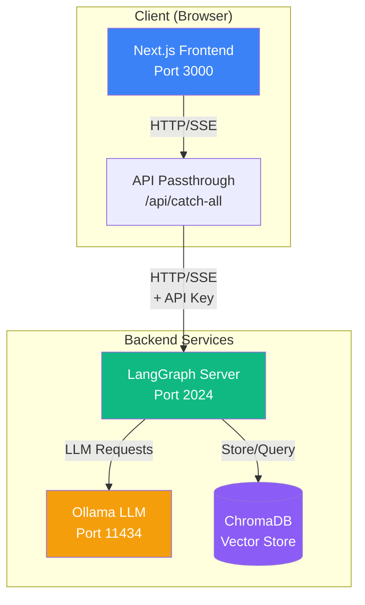

---

## 프론트엔드 아키텍처

### 구조 개요

프론트엔드는 Next.js 14+ (App Router)를 사용하며, React Context API를 통해 전역 상태를 관리합니다.

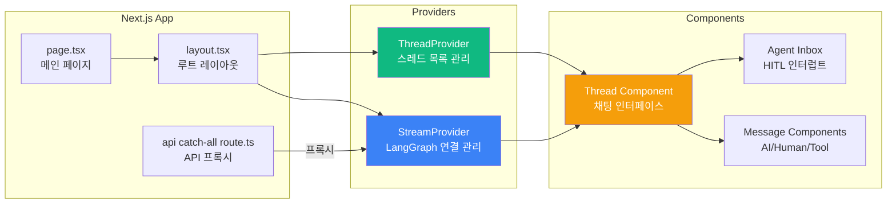

### 핵심 Provider 구조

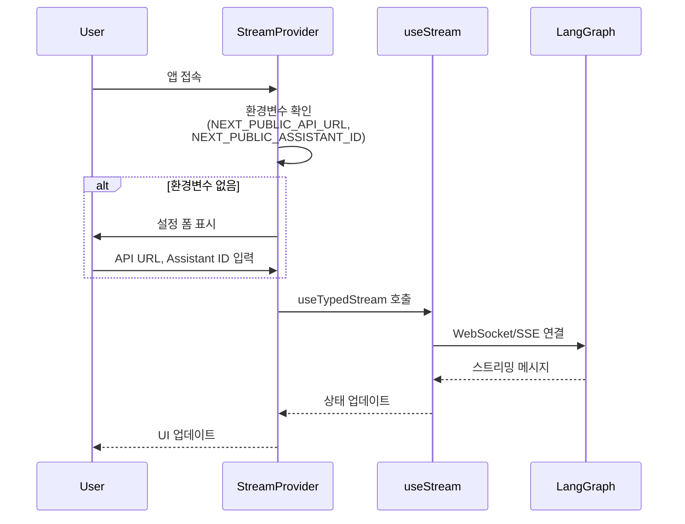

---

## 백엔드 아키텍처

### LangGraph 워크플로우

백엔드는 LangGraph를 사용하여 상태 기반 워크플로우를 구성합니다.

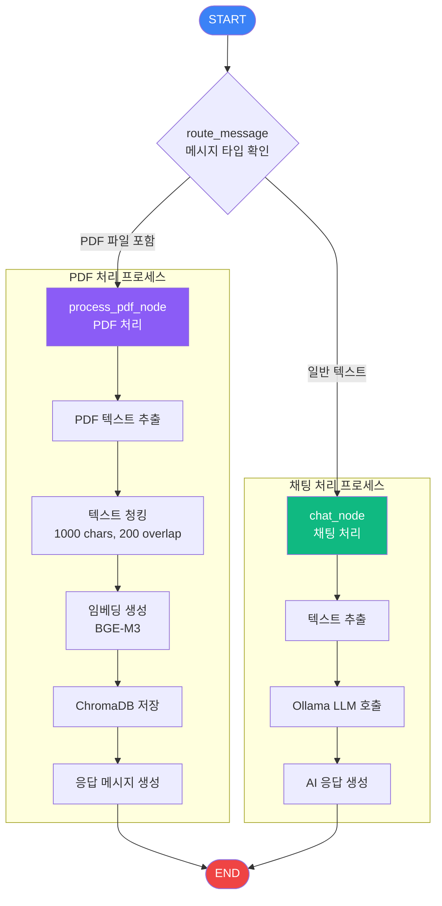

### 상태 관리

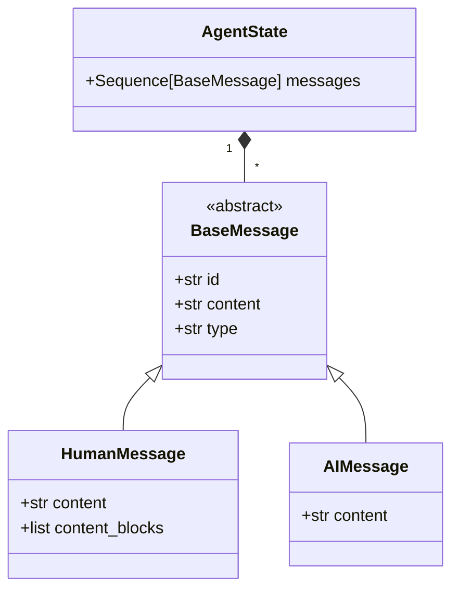

---

## 프론트엔드-백엔드 통신

### 통신 방식

프론트엔드와 백엔드는 **하이브리드 통신 방식**을 사용합니다:

#### 통신 프로토콜

1. **REST API**: 초기 요청 및 일부 작업
   - 스레드 목록 조회: `GET /threads/search`
   - 그래프 상태 확인: `GET /info`
   - 스레드 실행 시작: `POST /threads/{threadId}/runs`

2. **SSE (Server-Sent Events)**: 실시간 메시지 스트리밍
   - `useStream` 훅이 SSE를 통해 실시간으로 메시지 업데이트를 수신
   - 메시지가 생성되는 대로 스트리밍으로 전달
   - WebSocket이 아닌 SSE를 사용 (단방향 스트리밍)

#### 환경별 연결 방식

1. **개발 환경**: 클라이언트에서 LangGraph 서버로 직접 SSE 연결
2. **프로덕션 환경**: API Passthrough를 통한 프록시 연결 (SSE도 프록시됨)

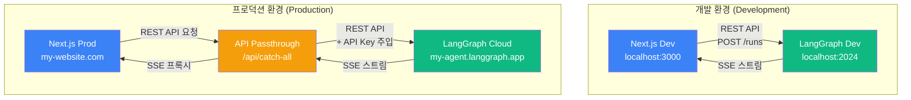

### 메시지 스트리밍 흐름

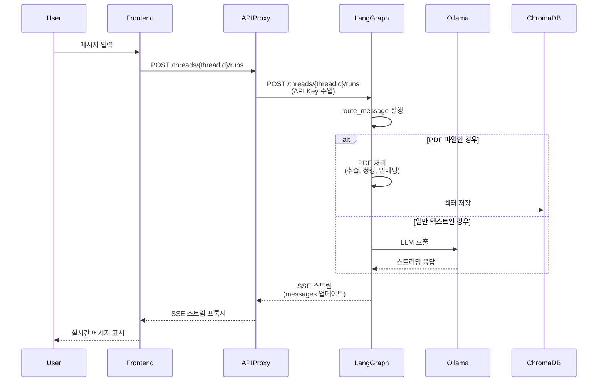

---

## 데이터 흐름

### 전체 데이터 흐름도

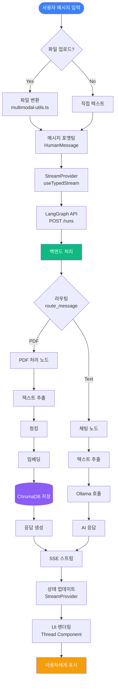

### PDF 처리 상세 흐름

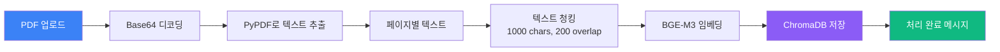

---

## 주요 컴포넌트

### 프론트엔드 컴포넌트 계층

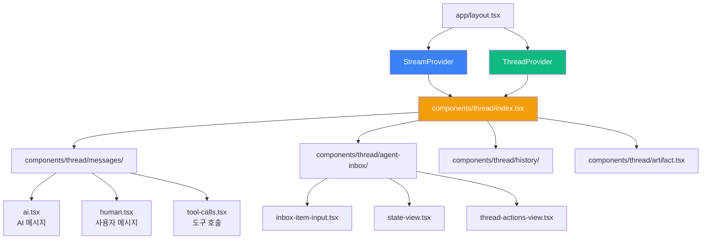

### 백엔드 모듈 구조

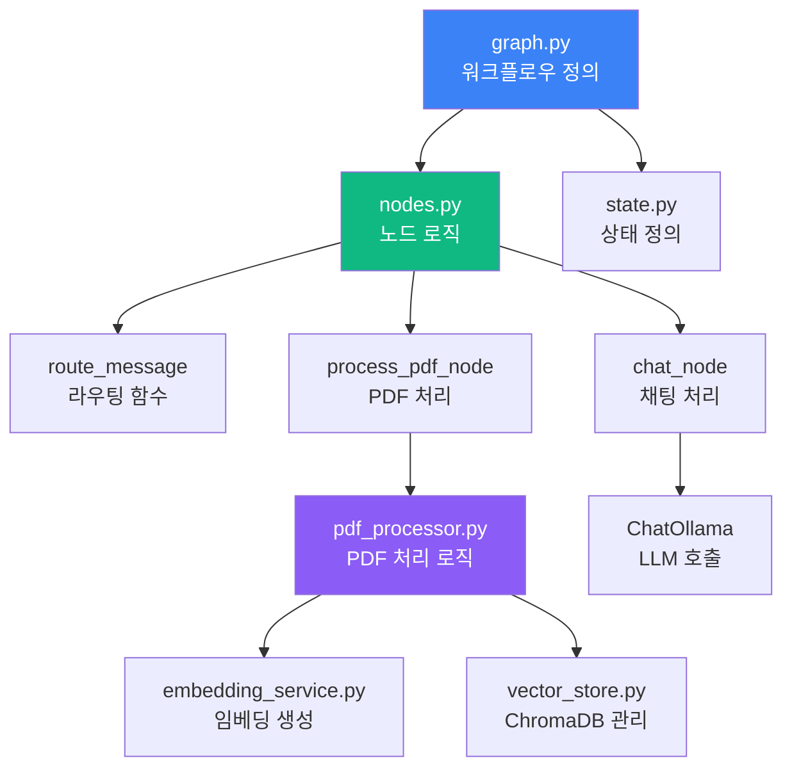

---

## 환경 변수 설정

### 개발 환경

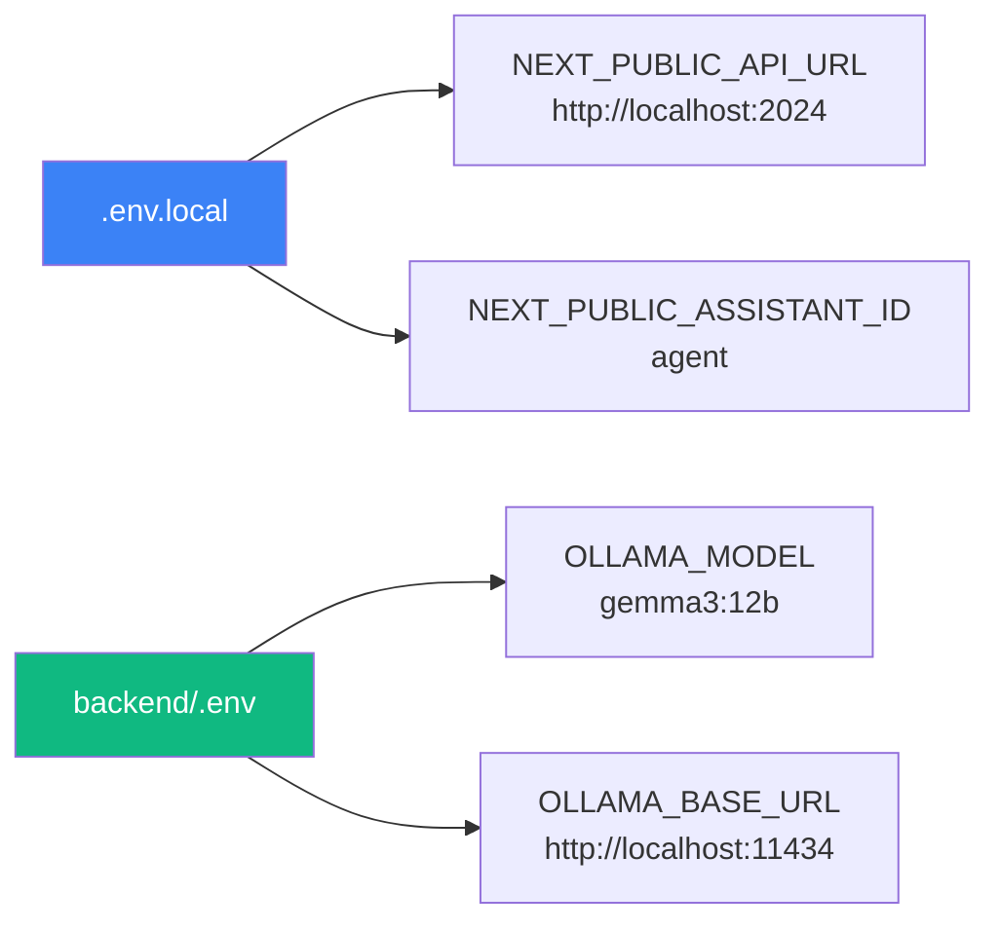

### 프로덕션 환경

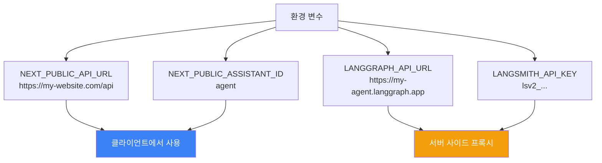

---

## 스레드 관리

### 스레드 생명주기

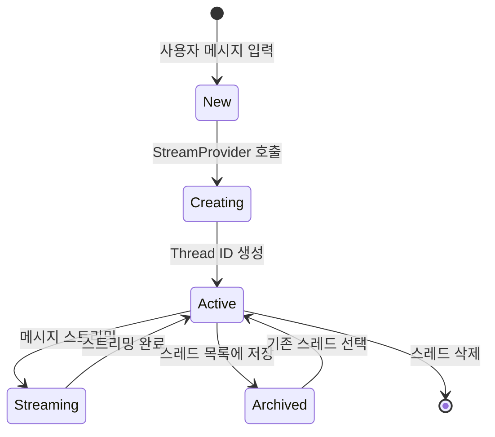

### 스레드 검색 메커니즘

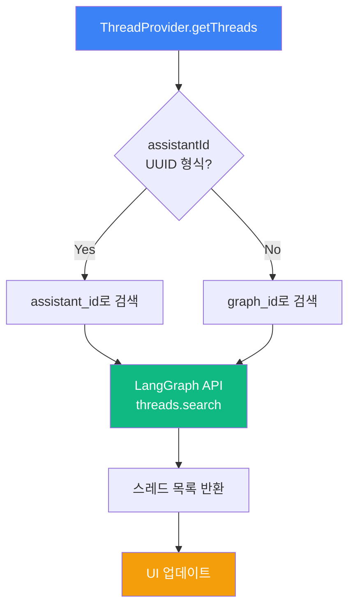

---

## HITL (Human-in-the-Loop) 인터럽트

### 인터럽트 처리 흐름

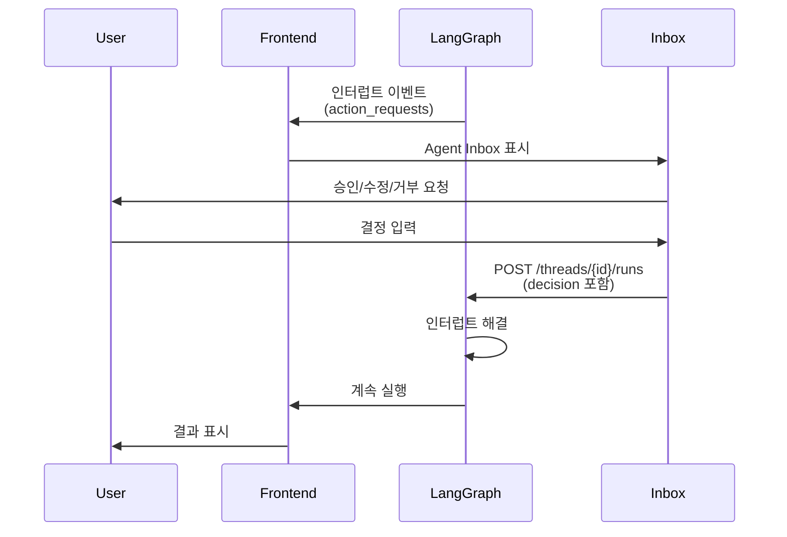

---

## 요약

### 핵심 아키텍처 특징

1. **프론트엔드**: Next.js + React Context API로 상태 관리
2. **백엔드**: LangGraph로 상태 기반 워크플로우 구성
3. **통신**: WebSocket/SSE를 통한 실시간 스트리밍
4. **프로덕션**: API Passthrough를 통한 보안 프록시
5. **PDF 처리**: 자동 라우팅 및 벡터 저장
6. **HITL**: 인간 개입을 위한 인터럽트 시스템

### 기술 스택

- **프론트엔드**: Next.js 14+, React, TypeScript, Tailwind CSS
- **백엔드**: Python 3.11+, LangGraph, LangChain, Ollama
- **데이터베이스**: ChromaDB (벡터 저장소)
- **LLM**: Ollama (로컬 모델)

---

## 주요 코드 스니펫

### 프론트엔드 핵심 코드

#### StreamProvider - LangGraph 연결 관리

```82:102:src/providers/Stream.tsx
  const streamValue = useTypedStream({
    apiUrl,
    apiKey: apiKey ?? undefined,
    assistantId,
    threadId: threadId ?? null,
    fetchStateHistory: true,
    onCustomEvent: (event, options) => {
      if (isUIMessage(event) || isRemoveUIMessage(event)) {
        options.mutate((prev) => {
          const ui = uiMessageReducer(prev.ui ?? [], event);
          return { ...prev, ui };
        });
      }
    },
    onThreadId: (id) => {
      setThreadId(id);
      // Refetch threads list when thread ID changes.
      // Wait for some seconds before fetching so we're able to get the new thread that was created.
      sleep().then(() => getThreads().then(setThreads).catch(console.error));
    },
  });
```

#### API Passthrough 설정

```6:11:src/app/api/[..._path]/route.ts
export const { GET, POST, PUT, PATCH, DELETE, OPTIONS, runtime } =
  initApiPassthrough({
    apiUrl: process.env.LANGGRAPH_API_URL ?? "remove-me", // default, if not defined it will attempt to read process.env.LANGGRAPH_API_URL
    apiKey: process.env.LANGSMITH_API_KEY ?? "remove-me", // default, if not defined it will attempt to read process.env.LANGSMITH_API_KEY
    runtime: "edge", // default
  });
```

### 백엔드 핵심 코드

#### LangGraph 워크플로우 정의

```6:28:backend/src/agent/graph.py
# Create the graph
workflow = StateGraph(AgentState)

# Add nodes (no route node - route_message is just a conditional function)
workflow.add_node("process_pdf", process_pdf_node)
workflow.add_node("chat", chat_node)

# Add conditional edges from START based on message type
workflow.add_conditional_edges(
    START,
    route_message,  # Function that returns next node name
    {
        "process_pdf": "process_pdf",
        "chat": "chat"
    }
)

# Add edges to END
workflow.add_edge("process_pdf", END)
workflow.add_edge("chat", END)

# Compile (LangGraph API handles persistence automatically)
graph = workflow.compile()
```

#### 메시지 라우팅 로직

```52:65:backend/src/agent/nodes.py
def route_message(state: AgentState) -> str:
    """Determine which node to route to based on the message."""
    last_message = state["messages"][-1]

    if isinstance(last_message, HumanMessage):
        content = last_message.content
        if isinstance(content, list):
            for item in content:
                if isinstance(item, dict) and item.get('type') == 'image_url':
                    url = _extract_url_from_item(item)
                    if _is_pdf_url(url):
                        return "process_pdf"

    return "chat"
```

#### 상태 정의

```11:13:backend/src/agent/state.py
class AgentState(TypedDict):
    """Simple agent state with only messages."""
    messages: Annotated[Sequence[BaseMessage], add_messages]
```

#### 스레드 검색 메커니즘

```26:34:src/providers/Thread.tsx
function getThreadSearchMetadata(
  assistantId: string,
): { graph_id: string } | { assistant_id: string } {
  if (validate(assistantId)) {
    return { assistant_id: assistantId };
  } else {
    return { graph_id: assistantId };
  }
}
```

### 주요 패턴

#### 1. 환경 변수 우선순위

프론트엔드에서는 URL 쿼리 파라미터 > 환경 변수 순으로 우선순위를 가집니다:

```141:162:src/providers/Stream.tsx
  // Use URL params with env var fallbacks
  const [apiUrl, setApiUrl] = useQueryState("apiUrl", {
    defaultValue: envApiUrl || "",
  });
  const [assistantId, setAssistantId] = useQueryState("assistantId", {
    defaultValue: envAssistantId || "",
  });

  // For API key, use localStorage with env var fallback
  const [apiKey, _setApiKey] = useState(() => {
    const storedKey = getApiKey();
    return storedKey || "";
  });

  const setApiKey = (key: string) => {
    window.localStorage.setItem("lg:chat:apiKey", key);
    _setApiKey(key);
  };

  // Determine final values to use, prioritizing URL params then env vars
  const finalApiUrl = apiUrl || envApiUrl;
  const finalAssistantId = assistantId || envAssistantId;
```

#### 2. PDF 처리 흐름

PDF 파일이 감지되면 자동으로 PDF 처리 노드로 라우팅됩니다:

```85:105:backend/src/agent/nodes.py
def process_pdf_node(state: AgentState) -> AgentState:
    """Process uploaded PDF and return results."""
    last_message = state["messages"][-1]

    try:
        content = last_message.content
        pdf_result = None

        if isinstance(content, list):
            pdf_result = _extract_pdf_from_message(content)

        if not pdf_result:
            state["messages"].append(
                AIMessage(content="❌ **PDF Processing Error**\n\nNo PDF file found in the message.")
            )
            return state

        pdf_data, filename = pdf_result

        # Process PDF
        result = pdf_processor.process_pdf(pdf_data, filename)
```

#### 3. 스트리밍 메시지 처리

실시간 스트리밍 메시지는 `onCustomEvent` 콜백을 통해 처리됩니다:

```88:95:src/providers/Stream.tsx
    onCustomEvent: (event, options) => {
      if (isUIMessage(event) || isRemoveUIMessage(event)) {
        options.mutate((prev) => {
          const ui = uiMessageReducer(prev.ui ?? [], event);
          return { ...prev, ui };
        });
      }
    },
```

